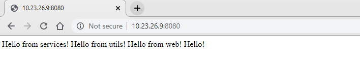

There is a multi-module project with the following structure: 
```
jar <--admin \ 
              |----services --- utils 
war <-- web  / 
```

### Maven
1) JAR
- Maven command to get the final (admin) jar file:
```
mvn package
```
- Location of the final (admin) jar file:
```
/admin/target
```
- Name of the final (admin) jar file:
```
java-jar-project-jar-with-dependencies.jar
```
- Run the final (admin) jar file:
```
java -jar java-jar-project-jar-with-dependencies.jar <WORD>
```
- Result of the final (admin) jar file:
```
vagrant@EPUAKHAWO13DT28:~/admin/target$ java -jar java-jar-project-jar-with-dependencies.jar Hello
You say [Hello], I say Hello from admin! Hello from services! Hello from utils!
```
2) WAR
- Maven command to get the final (web) war file:
```
mvn package
```
- Location of the final (web) war file:
```
/web/target
```
- Name of the final (web) war file:
```
java-war-project.war
```
- Run the final (web) war file:
```
mvn -pl web jetty:run
```
- Result of the final (web) war file:


